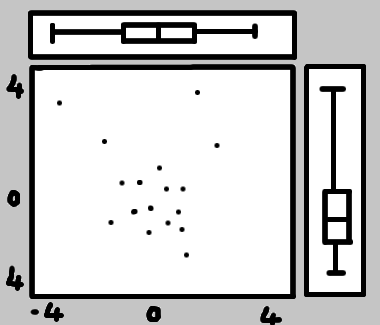

# TD02_1 : Les graphiques composés {data-background=#273142}

## Objectifs

Créer un graphique avec un nuage de 100 points au centre et des `boxplot` représentant la distribution en x et en y.

## Méthodes

1- Lister les différentes étapes

2- Se mettre d'accord sur les étapes

3- ... et enfin coder en R

## Etape 01 : dessiner le graphique "à la main"



## Etape 02 : faire chaque graphique

```{r, fig.width = 10, fig.height = 4}
nuageP <- data.frame(x = rnorm(100), y = rnorm(100))
par(mfrow = c(1, 3))
plot(nuageP)
boxplot(nuageP$x, horizontal = TRUE)
boxplot(nuageP$y)
```

## Etape 03 : positionner les graphiques

```{r, eval = FALSE}
layout(matrix(c(
  2, 1, 1, 1, 1, 
  2, 1, 1, 1, 1, 
  2, 1, 1, 1, 1, 
  2, 1, 1, 1, 1, 
  0, 3, 3, 3, 3
), ncol = 5))
par(mar = c(4, 4, 1, 1))
plot(nuageP)
par(mar = c(2, 4, 1, 1))
boxplot(nuageP$x, horizontal = TRUE)
par(mar = c(4, 1, 1, 1))
boxplot(nuageP$y)
```

## Etape 03 : positionner les graphiques

```{r, echo = FALSE, fig.width = 10, fig.height = 6}
layout(matrix(c(
  2, 1, 1, 1, 1, 
  2, 1, 1, 1, 1, 
  2, 1, 1, 1, 1, 
  2, 1, 1, 1, 1, 
  0, 3, 3, 3, 3
), ncol = 5))
par(mar = c(4, 4, 1, 1))
plot(nuageP)
par(mar = c(2, 4, 1, 1))
boxplot(nuageP$x, horizontal = TRUE)
par(mar = c(4, 1, 1, 1))
boxplot(nuageP$y)
```

# TD02_1 : Les graphiques depuis un fichier {data-background=#273142}

## Objectifs

Faire quelques graphiques à partir des données de prénoms.

## exercices libres

```{r}
bddPrenoms <- read.table("./DATA/Prenoms.csv", 
  header = TRUE, sep = ";", dec = ".")
names(bddPrenoms)
str(bddPrenoms)
```

## exercices libres

```{r, fig.width = 10, fig.height = 4}
barplot(bddPrenoms$X04_frequence, names = bddPrenoms$X01_prenom, las = 3)
```

## exercices libres

```{r, fig.width = 10, fig.height = 4}
bddPrenoms <- bddPrenoms[order(bddPrenoms$X04_frequence),]
barplot(bddPrenoms$X04_frequence, names = bddPrenoms$X01_prenom, las = 3)
```

## exercices libres

```{r, fig.width = 10, fig.height = 4}
bddPrenoms <- bddPrenoms[order(
  bddPrenoms$X04_frequence, decreasing = TRUE),]
barplot(bddPrenoms$X04_frequence, names = bddPrenoms$X01_prenom, las = 3)
```

## exercices libres

```{r, fig.width = 10, fig.height = 4}
barplot(
  bddPrenoms$X04_frequence[bddPrenoms$X03_langage == "french"], 
  names = bddPrenoms$X01_prenom[bddPrenoms$X03_langage == "french"], 
  las = 3)
```

## exercices libres

```{r, fig.width = 10, fig.height = 4}
barplot(
  head(bddPrenoms$X04_frequence[bddPrenoms$X03_langage == "french"], 20),
  names = head(
    bddPrenoms$X01_prenom[bddPrenoms$X03_langage == "french"], 20), 
  las = 3)
```

## exercices libres

```{r, eval = FALSE}
myCol = head(bddPrenoms$X02_genre[bddPrenoms$X03_langage == "french"], 20)
# print(myCol)
myCol <- gsub(myCol, pattern = "m", replacement = "lightblue")
myCol <- gsub(myCol, pattern = "f", replacement = "pink")
myCol <- gsub(myCol, pattern = "m,f|f,m", replacement = "lightgreen")
# print(myCol)
barplot(
  head(bddPrenoms$X04_frequence[bddPrenoms$X03_langage == "french"], 20),
  names = head(
    bddPrenoms$X01_prenom[bddPrenoms$X03_langage == "french"], 20), 
  las = 3, col = myCol)
```

## exercices libres

```{r, echo = FALSE, fig.width = 10, fig.height = 6}
myCol = head(bddPrenoms$X02_genre[bddPrenoms$X03_langage == "french"], 20)
myCol <- gsub(myCol, pattern = "m", replacement = "lightblue")
myCol <- gsub(myCol, pattern = "f", replacement = "pink")
myCol <- gsub(myCol, pattern = "m,f|f,m", replacement = "lightgreen")
barplot(
  head(bddPrenoms$X04_frequence[bddPrenoms$X03_langage == "french"], 20),
  names = head(
    bddPrenoms$X01_prenom[bddPrenoms$X03_langage == "french"], 20), 
  las = 3, col = myCol)
```

## exercices libres

```{r, eval = FALSE}
xPos <- barplot(
  head(bddPrenoms$X04_frequence[bddPrenoms$X03_langage == "french"], 20),
  names = head(
    bddPrenoms$X01_prenom[bddPrenoms$X03_langage == "french"], 20), 
  las = 3, col = myCol, ylim = c(0, 200))
text(x = xPos, 
  y = head(
    bddPrenoms$X04_frequence[bddPrenoms$X03_langage == "french"], 20),
  labels = round(head(
    bddPrenoms$X04_frequence[bddPrenoms$X03_langage == "french"], 20)),
  pos = 3)
```

## exercices libres

```{r, echo = FALSE, fig.width = 10, fig.height = 6}
xPos <- barplot(
  head(bddPrenoms$X04_frequence[bddPrenoms$X03_langage == "french"], 20),
  names = head(
    bddPrenoms$X01_prenom[bddPrenoms$X03_langage == "french"], 20), 
  las = 3, col = myCol, ylim = c(0, 200))
text(x = xPos, 
  y = head(
    bddPrenoms$X04_frequence[bddPrenoms$X03_langage == "french"], 20),
  labels = round(head(
    bddPrenoms$X04_frequence[bddPrenoms$X03_langage == "french"], 20)),
  pos = 3)
```


# <a href = "R014_intro.html"> SUIVANT </a> {data-background=#273142}


