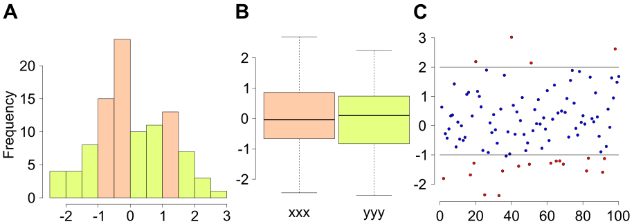

# Manipulation des données, statistiques descriptives et graphiques {data-background=#273142}

## Stats descr.

Statistique descriptive : résumer l'information avec caractéristiques essentielles.

Comment ? Avec des *indicateurs* et des *représentations graphiques*.

## Stats descr.

```{r}
bdd <- read.table("./DATA/bdd.csv", header = TRUE, sep = ",", dec = ".")
head(bdd)
```

## Stats descr.

```{r}
nrow(bdd)
ncol(bdd)
```

## Stats descr.

```{r}
# moyenne
mean(bdd$temperature)
# médiane
median(bdd$temperature)
# minimum
min(bdd$temperature)
# maximum
max(bdd$temperature)
```

## Stats descr.

```{r}
# sqrt(variance) = écart-type
n <- length(bdd$temperature)
xi <- bdd$temperature
sn <- 1/(n-1) * sum(xi^2 - mean(xi)^2)
print(sn)
var(xi) # avec R
sqrt(sn)
sd(xi) # avec R
```

## Stats descr.

```{r}
# quantiles
quantile(xi)
quantile(xi, probs = 0.5)
```

## Stats descr.

```{r}
summary(bdd$temperature)
```

## Stats descr.

```{r}
summary(bdd[c("temperature", "humidity", "pressure")])
```

## Stats descr.

```{r}
summary(bdd[c(7, 9, 10)])
```

## Stats descr.

moyennes par mois ?

```{r}
bdd$date <- as.POSIXct(
  paste(
    bdd$year, bdd$month, bdd$day, bdd$hour, bdd$minute, bdd$second),
  format = "%Y %m %d %H %M %S"
)
head(bdd$date)
```

## Stats descr.

```{r}
dateDay <- format(bdd$date, "%Y/%m/%d")
tempDay <- tapply(
  X = bdd$temperature, 
  INDEX = dateDay,
  FUN = mean)
```

## Stats descr.

```{r, fig.width = 10, fig.height = 4}
plot(
  x = as.Date(names(tempDay), format = "%Y/%m/%d"),
  y = tempDay, xlab = "Time",ylab = "Temperature (°C)",
  type = "l", lwd = 2)
```

## Stats descr.

```{r}
temp3q <- tapply(
  X = bdd$temperature, 
  INDEX = dateDay,
  FUN = quantile, probs = 0.75)
temp1q <- tapply(
  X = bdd$temperature, 
  INDEX = dateDay,
  FUN = quantile, probs = 0.25)
```

## Stats descr.

```{r, eval = FALSE}
plot(
  x = as.Date(names(tempDay), format = "%Y/%m/%d"),
  y = tempDay, xlab = "Time",ylab = "Temperature (°C)",
  type = "l", lwd = 2)
points(
  x = as.Date(names(temp3q), format = "%Y/%m/%d"),
  y = temp3q, xlab = "Time",ylab = "Temperature (°C)",
  type = "l", lwd = 2, col = "red")
points(
  x = as.Date(names(temp1q), format = "%Y/%m/%d"),
  y = temp1q, xlab = "Time",ylab = "Temperature (°C)",
  type = "l", lwd = 2, col = "blue")
```

## Stats descr.

```{r, fig.width = 10, fig.height = 6, echo = FALSE}
plot(
  x = as.Date(names(tempDay), format = "%Y/%m/%d"),
  y = tempDay, xlab = "Time",ylab = "Temperature (°C)",
  type = "l", lwd = 2)
points(
  x = as.Date(names(temp3q), format = "%Y/%m/%d"),
  y = temp3q, xlab = "Time",ylab = "Temperature (°C)",
  type = "l", lwd = 2, col = "red")
points(
  x = as.Date(names(temp1q), format = "%Y/%m/%d"),
  y = temp1q, xlab = "Time",ylab = "Temperature (°C)",
  type = "l", lwd = 2, col = "blue")
```

## Stats descr.

```{r, fig.width = 10, fig.height = 5}
boxplot(bdd$temperature ~ format(bdd$date, "%Y/%m/%d"))
```

## Stats descr.

```{r, fig.width = 10, fig.height = 4}
par(mar = c(6, 2, 1, 1))
boxplot(bdd$temperature ~ format(bdd$date, "%Y/%U"), 
  las = 3, xlab = "", ylab = "")
```

## Stats descr.

```{r, fig.width = 10, fig.height = 4}
par(mar = c(6, 2, 1, 1))
boxplot(bdd$temperature ~ format(bdd$date, "%Y/%m"), 
  las = 3, xlab = "", ylab = "")
```

## Stats descr.

```{r, eval = FALSE}
tempMonthMean <- tapply(bdd$temp, 
  INDEX = format(bdd$date, format = "%Y-%m"), FUN = mean)
myCol <- colorRampPalette(c("blue", "red"))(101)
tempMeanDayPos <- round(
  (tempMonthMean - min(tempMonthMean)) / 
    (max(tempMonthMean) - min(tempMonthMean))*100) + 1
par(mar = c(6, 2, 1, 1))
boxplot(bdd$temp ~ format(bdd$date, format = "%Y-%m"), las = 3, 
  col = myCol[tempMeanDayPos],
  xlab = "", ylab = "")
```

## Stats descr.

```{r, echo = FALSE, fig.width = 10, fig.height = 6}
tempMonthMean <- tapply(bdd$temp, 
  INDEX = format(bdd$date, format = "%Y-%m"), FUN = mean)
myCol <- colorRampPalette(c("blue", "red"))(101)
tempMeanDayPos <- round(
  (tempMonthMean - min(tempMonthMean)) / 
    (max(tempMonthMean) - min(tempMonthMean))*100) + 1
par(mar = c(6, 2, 1, 1))
boxplot(bdd$temp ~ format(bdd$date, format = "%Y-%m"), las = 3, 
  col = myCol[tempMeanDayPos],
  xlab = "", ylab = "", outline = FALSE)
```

## Stats descr.

```{r}
# https://fr.climate-data.org
tempRefMoy <- rep(c(11.4, 6.8, 3.9, 3, 3.9, 7.6, 10.6, 14, 17.1, 
  19, 18.7, 16.2), 3)
tempRefMin <- rep(c(7.1, 3.7, 1.3, 0.1, 0.5, 2.8, 5.3, 8.6, 11.6, 
  13.5, 13.3, 11.1), 3)
tempRefMax <- rep(c(15.7, 9.9, 6.5, 5.9, 7.3, 12.4, 15.9, 19.5, 
  22.7, 24.6, 24.2, 21.3), 3)
```

## Stats descr.

```{r, eval = FALSE}
boxplot(bdd$temp ~ format(bdd$date, format = "%Y-%m"), las = 3, 
  col = myCol[tempMeanDayPos],
  xlab = "", ylab = "", outline = FALSE)
points(tempRefMoy, type = 'l', lwd = 2)
points(tempRefMin, type = 'l', lwd = 2, col = 4)
points(tempRefMax, type = 'l', lwd = 2, col = 2)
```

## Stats descr.

```{r, echo = FALSE, fig.width = 10, fig.height = 6}
boxplot(bdd$temp ~ format(bdd$date, format = "%Y-%m"), las = 3, 
  col = myCol[tempMeanDayPos],
  xlab = "", ylab = "", outline = FALSE)
points(tempRefMoy, type = 'l', lwd = 2)
points(tempRefMin, type = 'l', lwd = 2, col = 4)
points(tempRefMax, type = 'l', lwd = 2, col = 2)
```

## Stats descr.

Nombre de jours avec une temperature moyenne supérieure à 30°C ?
Nombre de jours avec une temperature moyenne inférieure à 5°C ?

## Stats descr.

```{r}
length(tempDay[tempDay >= 30])
length(tempDay[tempDay <= 5])
```

## Stats descr.

La température est une variable continue :

```{r}
head(bdd$temperature)
```

## Stats descr.

```{r}
myCut <- seq(from = -10, to = 60, by = 2)
print(myCut)
bddCut <- cut(bdd$temperature, breaks = myCut)
head(bddCut)
```

## Stats descr.

```{r}
tCut <- table(bddCut)
print(tCut)
```

## Stats descr.

```{r, fig.width = 10, fig.height = 5}
barplot(tCut, las = 3)
```

## Stats descr.

```{r, eval = FALSE}
barplot(
  table(
    cut(
      bdd$temperature, 
      breaks = seq(from = -10, to = 60, by = 2)
    )
  ), las = 3
)
```

## Stats descr.

```{r, fig.width = 10, fig.height = 5}
hist(bdd$temperature, breaks = myCut)
```

## Stats descr.

```{r, fig.width = 10, fig.height = 4}
hist(bdd$temperature, 
  breaks = c(-10, 0, 5, 10, 15, 20, 30, 100))
```

## Stats descr.

Fn(x) : % obs < x

```{r, fig.width = 10, fig.height = 4}
plot(ecdf(bdd$temperature))
```

# Statistiques descriptives : du graphique à la figure dans un article scientifique {data-background=#273142}

## Inkscape

https://inkscape.org

```{r echo = FALSE, out.width = "50%"}

```

## Inkscape

```{r, fig.width = 10, fig.height = 5}
barplot(sample(10:15, 8, replace = TRUE), 
  col = 1:8, names.arg = 1:8)
```

## Inkscape

```{r}
pdf("barplot.pdf")
  barplot(sample(10:15, 8, replace = TRUE), 
    col = 1:8, names.arg = 1:8)
dev.off()
```

## Inkscape

<a href = "./inkscape.mp4"> LINK VIDEO </a>

## Inkscape

```{r}
pdf("multplot.pdf")
  boxplot(rnorm(100), rnorm(100))
  plot(rnorm(100))
  hist(rnorm(100))
dev.off()
```

## Inkscape

```{r echo = FALSE, out.width = "150%"}

```

## The Gimp 

https://www.gimp.org

```{r echo = FALSE, out.width = "50%"}
knitr::include_graphics("logoGimp.png")
```

## The Gimp 

File / Export as... / tif / LZW compression


# <a href = "R031_statsSimple.html"> SUIVANT </a> {data-background=#273142}
