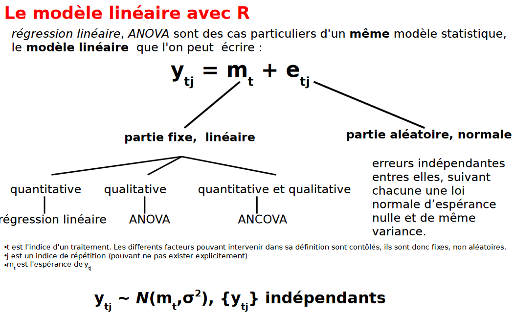

# Rappels sur le modèle linéaire {data-background=#273142}

## diapo de [S. Ballesteros, ENS](http://rug.mnhn.fr/semin-r/PDF/semin-R_glm_SBallesteros_100608.pdf)



# GLM `[glims]` (d'après *The R Book*) {data-background=#273142}

## Quand ?

Lorsque la variance n'est pas constante, et/ou que les erreurs ne sont pas distribuées selon une loi Normale.

C'est souvent le cas pour des réponses comme :

* les proportions
* les comptages
* les données binaires (mort ou vivant ; succès ou échec)
* les temps de survie / demi-vie

## Une structure des erreurs

Si les erreurs ne suivaient pas une loi Normale, nous avions recours à une transformation. Avec les GLM nous pouvons spécifier le type de distribution des erreurs : 

* loi Normale (lm classique)
* loi de Poisson (comptage : y entiers entre 0 et +Inf)
* loi Binomiale (proportions : y entier entre 0 et n cas, 0:1 ou 0:100)
* loi Gamma (y continue entre 0 et +Inf)
* loi Exponentielle (analyse de survie)

##

Pour spécifier le type de distribution des erreurs, on utilise l'argument `family`.

```{r, eval=FALSE}
glm(y ~ z, family = poisson)
```

La variable explicative peut être quantitative continue (analyse de régression), ou qualitative (catégories / facteurs ; analyse de type ANOVA).

## Un prédicteur linéaire

Pour expliquer $y$, nous utilisons une composante déterministe qui nous permet de voir quels sont les prédicteurs ($\beta0+\beta_1x_1+...+\beta_px_p$). Cette combinaison linéaire est appelée prédicteur linéaire et s'exprime avec $\eta$ (eta) :

$$\eta_i=\sum_{j=1}^{p}x_{ij}\beta_j$$

## Fonction de lien

La qualité de l'ajustement des GLM se fait en évaluant le prédicteur linéaire pour chaque valeur de la variable de réponse et le compare à une valeur transformée de y au moyen d'une **fonction de lien**.

Cette fonction de lien est à définir pour chaque cas (minimiser la déviance résiduelle). Pour une première approche on pourra laisser les fonctions de lein par défaut.

# Exemple : données de comptage ~ var qt {data-background=#273142}

## Données de comptage

Loi de Poisson de paramètre lambda ($\lambda$) : 

* valeurs entre 0 et +Inf
* $Pr(Y=y)=\frac{e^{−λ}*\lambda^y}{y!}$

## 

```{r, warning=FALSE, eval = FALSE}
library("palettesForR")
par(mfrow = c(2, 2))
trash <- sapply(c(1, 2, 5, 10), function(i){
  hist(rpois(n = 1000, lambda = i), breaks = 0:30, 
    main = paste0("Poisson (\u03BB=", i, ")"), 
    col = Dark_gpl)
})
```

## 

```{r, echo = FALSE, fig.width=10, fig.height=7}
library("palettesForR")
par(mfrow = c(2, 2))
trash <- sapply(c(1, 2, 5, 10), function(i){
  hist(rpois(n = 1000, lambda = i), breaks = 0:30, 
    main = paste0("Poisson (\u03BB=", i, ")"), 
    col = Dark_gpl)
})
```

## Hypothèses

* réponses indépendantes (sinon => Generalized Linear Mixed Models)
* réponses distribuées selon une loi de Poisson.
* pas de surdispersion

## surdispersion ?

Surdispersion si `residual deviance` > `degrees of freedom`

```{r}
y <- rpois(n = 1000, lambda = 5)
x <- 1:1000
modSum <- summary(glm(y ~ x, family = "poisson"))
phiEst <- modSum$null.deviance / modSum$df[2]
print(phiEst) # > 1 ?
```

## 

*Les principales cause des surdispersions sont :*

*- une corrélation entre les réponses,*

*- l’absence d’une variable explicative importante,*

*- un sur-représentation des valeurs zéro par rapport à ce qui est attendue selon la distribution de Poissson de paramètre Lambda.*

*En cas de surdispersion, il est nécessaire d’utiliser d’autres structures d’erreur, telles que les structures 'quasi Poisson' ou 'négative binomiale'.* C. Della Vedova

Ici : absence d’une variable explicative importante

## 

```{r}
# comptage de lynx en fonction des tâches solaires
suns <- as.vector(ts.intersect(lynx, sunspot.year)[,"sunspot.year"])
lynx <- as.vector(ts.intersect(lynx, sunspot.year)[,"lynx"])
modSum <- summary(glm(lynx ~ suns, family = "poisson"))
print(modSum)
```

## Hypothèses

Indépendance : oui (sous l'hypothèse que les lynx tués une année n'influencent pas les populations des années suivantes - en tout cas à la fin du XIXème - ... )

## Hypothèses

Distribution de Poisson : 

```{r}
mean(lynx)
distrTheo <- rpois(length(lynx), lambda = mean(lynx))
```

## Hypothèses

```{r, fig.width=10, fig.height=4}
hist(lynx)
hist(distrTheo, col = 2, add = TRUE)
```

## Hypothèses

Distribution de Poisson : non

## Hypothèses

Sudispersion : oui

```{r}
phiEst <- modSum$null.deviance / modSum$df[2]
print(phiEst) # > 1 ?
# très forte surdispersion : on change de structure d'erreur
```

## Structure quasipoisson (surdispersion)

```{r}
modSum <- summary(glm(lynx ~ suns, family = "quasipoisson"))
print(modSum)
```

# Exemple : données de comptage ~ var ql {data-background=#273142}

## Données de comptage (dataset depuis Kaggle)

[Nombre de feux au Brésil par état](https://www.kaggle.com/gustavomodelli/forest-fires-in-brazil)

##

```{r}
feux <- read.table("./DATA/amazon.csv", 
  header = TRUE, sep = ",")
feux$number <- as.integer(feux$number)
library("palettesForR")
```

##

```{r, fig.width=10, fig.height=5}
par(mar = c(8, 2, 1, 1))
boxplot(feux$number ~ feux$state, 
  las = 3, xlab = "", col = Tango_gpl)
```

## 

```{r}
tapply(feux$number, INDEX = feux$state, FUN = sum)
```

## 

```{r}
feux$state <- factor(
  feux$state, 
  levels(feux$state)[order(
    tapply(feux$number, INDEX = feux$state, FUN = sum))
  ])
```

##

```{r, fig.width=10, fig.height=5}
par(mar = c(8, 2, 1, 1))
boxplot(feux$number ~ feux$state, 
  las = 3, xlab = "", col = Tango_gpl)
```

##

```{r}
tapply(feux$number, INDEX = feux$state, FUN = summary)
```

##

```{r}
modL <- glm(feux$number ~ feux$state, family = "poisson")
print(modL)
```

## Hypothèses

* Indépendance : ok?
* Distrib. poisson ? surdispersion ?

## 

```{r}
summary(modL)
```

##

Le ratio residual deviance / ddl est égal à 1254755 / 6431 = 195.
Beaucoup de surdispersion ! Il est nécessaire d’utiliser une autre structure d’erreur.

##

```{r}
modL <- glm(feux$number ~ feux$state, family = "quasipoisson")
summary(modL)
```

## Interprétation

Table de variance (cas surdispersion avec Fisher) :

```{r}
library("car")
Anova(modL, test.statistic = "F")
```

## Comp. multiples

```{r, warning=FALSE, error=FALSE, message=FALSE}
library(multcomp)
modL <- glm(number ~ state, family = "quasipoisson", data = feux)
tuk <- glht(modL, linfct = mcp(state = "Tukey"))
summary(tuk)
```

##

```{r, fig.width=10, fig.height=5}
par(mar=c(3, 7, 3, 3))
plot(tuk)
```

##

```{r, warning=FALSE, error=FALSE}
tukLetters <- cld(tuk)
tL <- tukLetters$mcletters$Letters
tLdf <- data.frame(
  state = levels(feux$state),
  letters = tL)
```

##

```{r, eval=FALSE}
par(mar = c(8, 2, 1, 1))
boxplot(feux$number ~ feux$state, ylim = c(0, 1200), 
  las = 3, xlab = "", col = Tango_gpl)
text(x = 1:length(levels(feux$state)), 
  y = rep(1100, length(levels(feux$state))), 
  labels = tLdf$letters, srt = 90)
```

##

```{r, echo=FALSE, fig.width=10, fig.height=7}
par(mar = c(8, 2, 1, 1))
boxplot(feux$number ~ feux$state, ylim = c(0, 1200), 
  las = 3, xlab = "", col = Tango_gpl)
text(x = 1:length(levels(feux$state)), 
  y = rep(1100, length(levels(feux$state))), 
  labels = tLdf$letters, srt = 90)
```

## pour aller plus loin...

The legal Amazon comprises the states of Acre, Amapá, Pará, Amazonas, Rondonia, Roraima, and part of Mato Grosso, Tocantins, and Maranhão.

# Exemple : données de type catégoriel binaire {data-background=#273142}

## Données de type catégoriel binaire (dataset depuis Kaggle)

On parle de *régression logistique*.

[Medical Cost Personal Datasets](https://www.kaggle.com/mirichoi0218/insurance/)

##

```{r}
secu <- read.table("./DATA/insurance.csv", 
  header = TRUE, sep = ",")
```

##

La proba. de fumer peut-elle s'expliquer par l'âge ?

```{r, fig.width=10, fig.height=5}
boxplot(secu$age ~ secu$smoker)
```

##

```{r}
secu$smoker <- as.character(secu$smoker)
secu$smoker[secu$smoker == "yes"] <- 1
secu$smoker[secu$smoker == "no"] <- 0
secu$smoker <- as.logical(as.numeric(secu$smoker))
```

## Age ?

```{r}
secu$ageT <- cut(secu$age, breaks = seq(from = 0, to = 100, by = 5))
```

## Age ?

```{r}
ni <- tapply(secu$smoker, INDEX = secu$ageT, FUN = length)
nT <- tapply(secu$smoker, INDEX = secu$ageT, FUN = sum)
nProp <- nT/ni
xT <- seq(from = 2.5, to = 97.5, by = 5)
dfSmoke <- data.frame(xT, nProp, nT, ni)
```

## Age ?

```{r, fig.width=10, fig.height=4}
plot(dfSmoke$nProp ~ dfSmoke$xT)
```

## Age ?

```{r}
summary(glm(secu$smoker ~ secu$age, family = "binomial"))
```

## Charges ?

Est-ce que le montant des charges de santé permet de prédire la proba de fumer ?

```{r}
secu$chargesT <- cut(secu$charges, breaks = seq(from = 0, to = 70000, by = 5000))
ni <- tapply(secu$smoker, INDEX = secu$chargesT, FUN = length)
nT <- tapply(secu$smoker, INDEX = secu$chargesT, FUN = sum)
nProp <- nT/ni
xT <- seq(from = 2500, to = 67500, by = 5000)
dfCharges <- data.frame(xT, nProp, nT, ni)
```

## Charges ?

```{r, fig.width=10, fig.height=4}
plot(dfCharges$nProp ~ dfCharges$xT)
```

## Charges ?

```{r}
modL <- glm(secu$smoker ~ secu$charges, family = "binomial")
summary(modL)
```

## Charges ?

```{r}
beta0 <- coef(modL)[1]
beta1 <- coef(modL)[2]
axeX <- seq(from = 0, to = 70000, length.out = 1000)
```

## Charges ?

```{r, eval=FALSE}
plot(
  x = dfCharges$xT,
  y = dfCharges$nProp,
  col = 'red', lwd = 3, xlim = c(0, 70000),
  ylim = c(0, 1), xlab = "Charges", ylab = "Proba(smoke)")
lines(
  axeX,
  plogis(beta0 + beta1*axeX) , col='blue' , lwd = 4, lty = 3)
legend("topleft", c("obs", "logit"), lwd = 3, col = c("red", "blue"))
```


## Charges ?

```{r, echo=FALSE, fig.width=10, fig.height=7}
plot(
  x = dfCharges$xT,
  y = dfCharges$nProp,
  col = 'red', lwd = 3, xlim = c(0, 70000),
  ylim = c(0, 1), xlab = "Charges", ylab = "Proba(smoke)")
lines(
  axeX,
  plogis(beta0 + beta1*axeX) , col='blue' , lwd = 4, lty = 3)
legend("topleft", c("obs", "logit"), lwd = 3, col = c("red", "blue"))
```

# Exemple : données de type catégoriel binaire (2) {data-background=#273142}

## Données de type catégoriel binaire (d'après cours E. Paradis)

## Dataset : AIDS in australia

```{r, warning=FALSE, message=FALSE}
library(MASS)
data(Aids2)
```

* state: Grouped state of origin: "NSW "includes ACT and "other" is WA, SA, NT and TAS.
* sex: Sex of patient.
* diag: (Julian) date of diagnosis.
* death: (Julian) date of death or end of observation.
* status: "A" (alive) or "D" (dead) at end of observation.
* T.categ: Reported transmission category.
* age: Age (years) at diagnosis.

## 

On va essayer d'expliquer le statut à la fin des observations.

## genre ?

```{r, fig.width=10, fig.height=5}
plot(y = Aids2$status, x = Aids2$sex)
```

## genre ?

```{r, fig.width=10, fig.height=5}
plot(Aids2$status ~ Aids2$sex)
```

## genre ?

```{r}
modL01 <- glm(status ~ sex, family = "binomial", data = Aids2)
summary(modL01)
```

## âge ?

```{r, fig.width=10, fig.height=5}
plot(y = Aids2$status, x = Aids2$age)
```

## âge ?

```{r, fig.width=10, fig.height=5}
plot(Aids2$status ~ Aids2$age)
```

## âge ?

```{r}
modL02 <- glm(status ~ age, family = "binomial", data = Aids2)
summary(modL02)
```

## âge ?

```{r}
Aids2$ageT <- cut(Aids2$age, breaks = seq(from = 0, to = 100, by = 10))
ni <- tapply(as.numeric(Aids2$status)-1, INDEX = Aids2$ageT, FUN = length)
nT <- tapply(as.numeric(Aids2$status)-1, INDEX = Aids2$ageT, FUN = sum)
nProp <- nT/ni
xT <- seq(from = 5, to = 95, by = 10)
dfage <- data.frame(xT, nProp, nT, ni)
modL <- modL02
```

## âge ?

```{r, eval=FALSE}
plot(
  x = dfage$xT,
  y = dfage$nProp,
  col = 'red', lwd = 3, xlim = c(0, 100),
  ylim = c(0, 1), xlab = "âge", ylab = "Proba(death)")

lines(
  x = seq(from = 0, to = 100, by = 10), 
  y = predict(modL, list(
    age = seq(from = 0, to = 100, by = 10)), 
    type = "response"), 
  col = 'blue', lwd = 4, lty = 3)
legend("topleft", c("obs", "logit"), lwd = 3, col = c("red", "blue"))
```

## âge ?

```{r, echo=FALSE, fig.width=10, fig.height=7}
plot(
  x = dfage$xT,
  y = dfage$nProp,
  col = 'red', lwd = 3, xlim = c(0, 100),
  ylim = c(0, 1), xlab = "âge", ylab = "Proba(death)")

lines(
  x = seq(from = 0, to = 100, by = 10), 
  y = predict(modL, list(
    age = seq(from = 0, to = 100, by = 10)), 
    type = "response"), 
  col = 'blue', lwd = 4, lty = 3)
legend("topleft", c("obs", "logit"), lwd = 3, col = c("red", "blue"))
```

## âge et genre ? 

```{r}
modL03 <- glm(status ~ age*sex, family = "binomial", data = Aids2)
summary(modL03)
```

## âge et genre ? 

```{r}
AIC(modL01)
AIC(modL02)
AIC(modL03)
```

On garde le modèle `modL02`.


# Exemple : données de type gamma [0 ; +Inf] {data-background=#273142}

## Données de temps de survie (d'après cours E. Paradis)

Survie en jours = date mort - date diagnostic

```{r}
Aids2$surv <- Aids2$death - Aids2$diag
```

## âge ?

```{r}
modLS01 <- glm(surv ~ age, family = "Gamma", 
  data = Aids2, subset = surv > 0)
summary(modLS01)
```


# <a href = "R101_finalTD.html"> Exploration de données </a> {data-background=#273142}


<!--
# Exemple : all-in-one {data-background=#273142}

## D'après le cours de magesblog.com
-->


<!--
https://magesblog.com/post/2015-08-04-generalised-linear-models-in-r/
https://tice.agroparistech.fr/coursenligne/courses/STAMAAE/document/Modele%20Lineaire%20Generalise/GLM_2016_par4.pdf?cidReq=STAMAAE
http://maths.cnam.fr/IMG/pdf/Presentation_MODGEN_02_2007.pdf
https://statistique-et-logiciel-r.com/tutoriel-glm-sur-donnees-de-comptage-regression-de-poisson-avec-r/
https://statistique-et-logiciel-r.com/introduction-aux-glmm-avec-donnees-de-proportion/
-->


<!--
##

TD point d'indice (loi gamma : continue 0 à +Inf)

# données extraites sur Internet depuis de multiples sources
# pas de responsabilité en cas d'erreur ou de fausses informations
# l'objectif est uniquement pédagogique, l'interprétation est la seule
# responsabilité des utilisateurs...
indF <- read.table("./DATA/indice.csv", 
  header = TRUE, sep = ";", dec = ",")
indF$ind <- c(0, 
  round((indF$euros[2:nrow(indF)] - indF$euros[1:(nrow(indF)-1)]) / 
  indF$euros[1:(nrow(indF)-1)]*100))
barplot(indF$ind, ylim = c(0, 20), 
  names.arg = indF$date, las = 3)

summary(aov(indF$ind~indF$president))

pres <- tapply(indF$ind, INDEX = indF$president, FUN = mean)
pres <- pres[order(pres)]
barplot(pres, cex.names=0.6)

plot(y = indF$ind, x = indF$rdtCerealesKgHa, pch = 16)
abline(lm(indF$ind~indF$rdtCerealesKgHa))
plot(indF$date, indF$rdtCerealesKgHa)
-->

